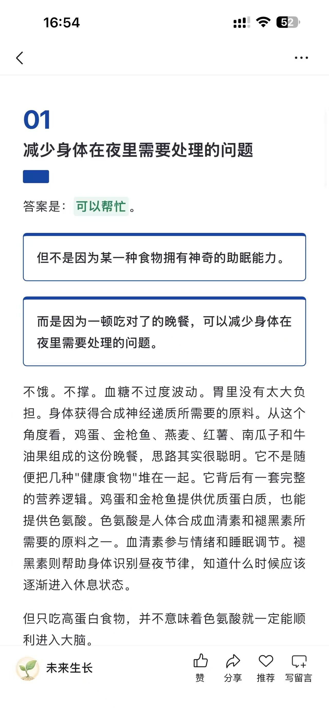
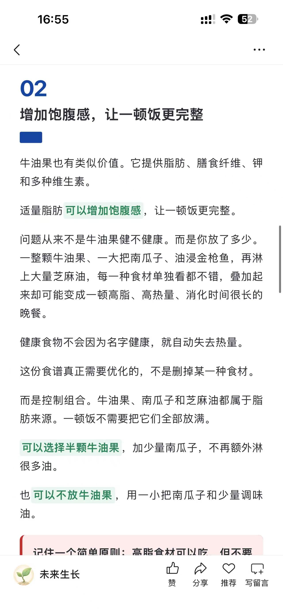
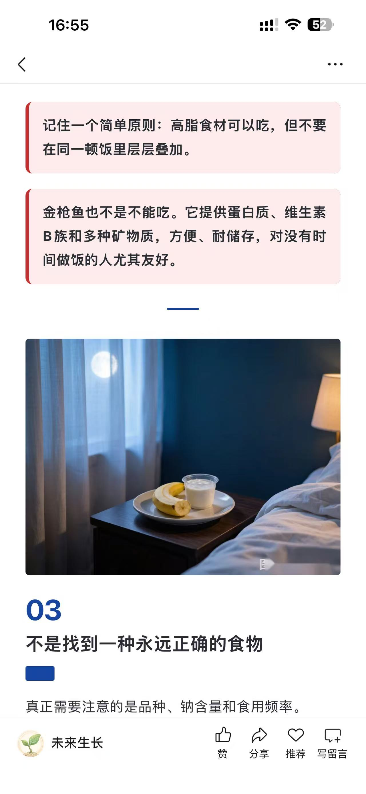
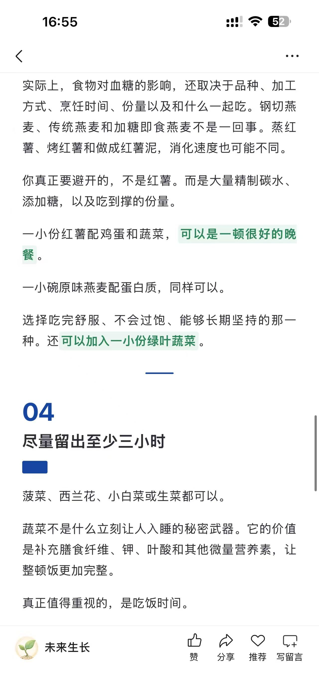
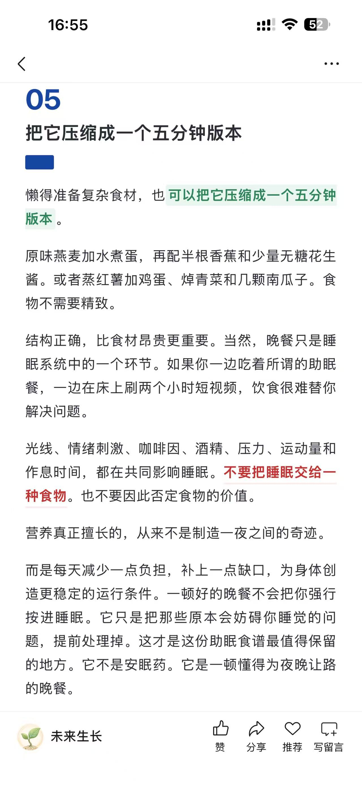

# 公众号排版-文章视觉

> v0.6.4｜Unified Macro Framework — 把中文文章或 Markdown 排成微信公众号手机端安全 HTML 和草稿箱 JSON，原文逐字保真。

[](CHANGELOG.md)
[](LICENSE)
[](templates/editorial-marker-registry.json)
[](RELEASE_REPORT.md)

一个 **WorkBuddy Skill**，专注于把中文 Markdown 或纯文本文章排成微信公众号可用的内联 HTML，同时生成完整的草稿箱 JSON。**原文是不可变数据**：不改写、不润色、不总结、不提炼、不扩写、不删减、不重组、不生成任何新文案。语义分析只选择稀疏的视觉样式。

---

## 核心能力

| 能力 | 说明 |
|------|------|
| **原文逐字保真** | 标题、小标题、引用、图片、图注、表格、参考资料和 CTA 全部按原顺序保留 |
| **94 个文章视觉标识** | 行内强调(15) / 标题(21) / 色块Callout(20) / 引用(6) / 列表流程(13) / 数据媒体(11) / 元信息(8) |
| **分层启用** | 13 自动安全 + 33 原文触发 + 22 手动指定 + 4 微信降级 |
| **4 套主题** | `editorial`（知识科普）/ `business`（商业工具）/ `minimal`（观点故事）/ `course`（课程说明） |
| **智能配图** | 封面 2.35:1 + 正文 3:4 规划，自动匹配视觉风格 |
| **三级验证** | quick / regression / release，发布前强制 release 通过 |
| **草稿箱 JSON** | 生成可直接导入微信公众号草稿箱的结构化 JSON |
| **微信安全** | 禁止 Script / Flex / Grid / Animation / Sticky，全部内联样式 |

---

## 实际案例

以下是一篇公众号文章使用本 skill 排版后的真实手机端效果（6 张截图，点击可放大）：

<table>
  <tr>
    <td width="33%" align="center"><a href="examples/screenshots/case-01.jpg"></a><br><sub>01 大序号标题 + 原文色块 + 绿色高亮</sub></td>
    <td width="33%" align="center"><a href="examples/screenshots/case-02.jpg"></a><br><sub>02 绿色高亮 + 红色删除线 + 配图</sub></td>
    <td width="33%" align="center"><a href="examples/screenshots/case-03.jpg"></a><br><sub>03 高亮强调 + 红色竖线引用</sub></td>
  </tr>
  <tr>
    <td width="33%" align="center"><a href="examples/screenshots/case-04.jpg"></a><br><sub>04 引用 + 配图 + 标题色块</sub></td>
    <td width="33%" align="center"><a href="examples/screenshots/case-05.jpg"></a><br><sub>05 高亮 + 分隔线 + 章节标题</sub></td>
    <td width="33%" align="center"><a href="examples/screenshots/case-06.jpg"></a><br><sub>06 红色强调 + 文末总结</sub></td>
  </tr>
</table>

> 完整 94 标识渲染图鉴：[🌐 在线预览](https://yxxx6666.github.io/wechat-editorial-skill/examples/v0.6.4-all-markers-showcase.html) ｜ [📄 源文件](examples/v0.6.4-all-markers-showcase.html)

---

## 一键安装

支持两个目标平台：**WorkBuddy**（`~/.workbuddy/skills/`）和 **Codex**（`~/.codex/skills/`）。默认自动检测，检测到哪个就装哪个。

### 方式一：Shell 一键安装（推荐）

```bash
# 自动检测（默认）
curl -fsSL https://raw.githubusercontent.com/yxxx6666/wechat-editorial-skill/main/install.sh | bash

# 指定目标
curl -fsSL https://raw.githubusercontent.com/yxxx6666/wechat-editorial-skill/main/install.sh | bash -s -- --target codex
curl -fsSL https://raw.githubusercontent.com/yxxx6666/wechat-editorial-skill/main/install.sh | bash -s -- --target workbuddy
curl -fsSL https://raw.githubusercontent.com/yxxx6666/wechat-editorial-skill/main/install.sh | bash -s -- --target all
```

| `--target` 值 | 说明 |
|---------------|------|
| `auto` | 自动检测已安装的平台（默认） |
| `workbuddy` | 仅安装到 `~/.workbuddy/skills/` |
| `codex` | 仅安装到 `~/.codex/skills/` |
| `all` | 同时安装到两个平台 |

多平台安装时，第一个目标为实体目录，其余为 symlink 指向第一个，保持单一来源。

### 方式二：手动安装

```bash
# 1. 克隆仓库
git clone https://github.com/yxxx6666/wechat-editorial-skill.git ~/.workbuddy/skills/wechat-editorial-skill

# Codex 用户额外建一个 symlink（可选）
ln -s ~/.workbuddy/skills/wechat-editorial-skill ~/.codex/skills/wechat-editorial-skill

# 2. 安装 Python 依赖
pip install pyyaml jsonschema

# 3. 验证安装
cd ~/.workbuddy/skills/wechat-editorial-skill
python scripts/quick_validate.py . --mode release
```

### 方式三：在 WorkBuddy 中使用

在 [WorkBuddy](https://www.codebuddy.cn) 中，通过 Skill 管理器导入本仓库，或直接在对话中 `@skill:wechat-editorial-skill` 调用。Codex 中使用 `$wechat-editorial-skill` 调用。

---

## 快速开始

### 基本用法

```bash
python scripts/build_article.py article.md --output-dir out
```

生成：

```
out/article.wechat.html   # 微信公众号可用 HTML
out/article.wechat.json   # 草稿箱 JSON + 验证报告
```

### 指定主题

```bash
python scripts/build_article.py article.md --output-dir out --theme business
```

主题说明：

| 主题 | 适用场景 | 视觉风格 |
|------|---------|---------|
| `editorial` | 知识科普、深度解读 | 沉稳蓝灰 + 学术感 |
| `business` | 商业发布、工具更新 | 干净利落 + 数据导向 |
| `minimal` | 观点、故事、读书笔记 | 极简留白 + 阅读优先 |
| `course` | 课程说明、教程指引 | 结构清晰 + 步骤感强 |
| `auto` | 自动选择（默认） | 根据文章类型匹配 |

### 生成全标识图鉴

```bash
python scripts/render_marker_showcase.py -o showcase.html
```

生成包含全部 72 个标识的渲染样例页，可用于预览和参考。

---

## 72 个文章视觉标识

### 启用级别

| 级别 | 数量 | 说明 |
|------|------|------|
| `auto_safe` | 13 | 可稀疏自动使用，无需原文特殊结构 |
| `source_triggered` | 33 | 原文已有明确结构时自动转换 |
| `manual` | 22 | 需用户手动指定 |
| `wechat_fallback` | 4 | 复杂互动组件降级为静态微信安全样式 |

### 分类一览

| 分类 | 数量 | 典型标识 |
|------|------|---------|
| **行内强调** | 12 | 重点加粗、实线下划线、点状下划线、删除线、段内高亮… |
| **标题** | 10 | 大序号标题(01/02/03)、左竖线标题、章节短横线… |
| **色块 Callout** | 16 | 原文重点色块、矩形原文框、定义框、事实框、提示框… |
| **引用** | 6 | 左侧竖线引用、无标题竖线、金句块… |
| **列表流程** | 10 | CSS 圆点列表、编号列表、步骤流程… |
| **数据媒体** | 10 | 数据强调、表格降级卡、图片图注… |
| **元信息** | 8 | 作者、日期、阅读时间、来源… |

> 完整标识注册表见 [`templates/editorial-marker-registry.json`](templates/editorial-marker-registry.json)
> 全标识渲染图鉴：[🌐 在线预览](https://yxxx6666.github.io/wechat-editorial-skill/examples/v0.6.4-all-markers-showcase.html)

---

## 验证

### 三级验证体系

```bash
# 快速检查（开发时用）
python scripts/quick_validate.py . --mode quick

# 回归验证（确保不破坏已有功能）
python scripts/quick_validate.py . --mode regression

# 发布验证（正式发布前必须通过）
python scripts/quick_validate.py . --mode release
```

### 发布门禁

| 门禁 | 要求 |
|------|------|
| `content_fidelity` | `status = pass` |
| `source_coverage` | `complete = true` |
| `source_order` | `preserved = true` |
| `P0` | `= 0` |
| `P1` | `= 0` |
| `visual_score` | `>= 88` |
| `generated_copy` | `= 0` |
| `generated_labels` | `= 0` |
| `rewritten_paragraphs` | `= 0` |
| 72 标识渲染回归 | `72/72 PASS` |

---

## 语义标记规则

### 允许的操作（只改样式，不改文字）

- **下划线**：轻强调核心概念、判断或风险
- **删除线**：只用于被修正的旧认知
- **段内高亮**：关键词、行动、提醒和数据
- **原文重点色块**：原文完整句子原样放入浅色背景与左侧竖线
- **左侧竖线**：完整引用或可截图金句
- **数据强调**：百分比、年份、时长、金额、倍数等

### 禁止的操作

- 生成"核心判断、行动建议、最后总结"等标签
- 自动增加 01/02/03 编号（只保留原文已有编号）
- 生成"编辑注"、批注或补充文案
- 自动结论卡片、渐变重点条
- 双栏重组原文（默认关闭）

### 密度控制

- 每段最多使用 1 种行内标记
- 整篇可见强调色最多 3 种（灰色和正文色不计入）
- 原文重点色块：短文最多 1 个，中长文最多 2 个
- 不要"能用都用"，转折后的落点优先于局部关键词

---

## 目录结构

```
wechat-editorial-skill/
├── SKILL.md                      # Skill 定义与工作流
├── README.md                     # 本文件
├── CHANGELOG.md                  # 版本历史
├── RELEASE_REPORT.md             # 发布验证报告
├── VERSION.md                    # 版本信息
├── pipeline.yaml                 # 流水线配置
├── install.sh                    # 一键安装脚本
│
├── core/                         # 核心引擎（29 个模块）
│   ├── content_fidelity_protocol.md    # 内容保真协议
│   ├── semantic_marker_system.md       # 语义标记系统
│   ├── editorial_marker_library.md     # 标识库说明
│   ├── wechat_component_contract.md    # 微信组件契约
│   ├── wechat_html_renderer.md         # HTML 渲染器
│   ├── wechat_html_rules.md            # HTML 安全规则
│   ├── visual_director.md              # 视觉导演
│   ├── typography_director.md          # 排版导演
│   ├── validator.md                    # 验证器
│   └── ...
│
├── scripts/                      # 可执行脚本
│   ├── build_article.py                # 构建入口（HTML+JSON）
│   ├── render_marker_showcase.py       # 全标识图鉴生成器
│   ├── quick_validate.py               # 三级验证
│   ├── md_to_wechat.py                 # 旧版构建入口
│   ├── sanitize_wechat_html.py         # HTML 安全清洗
│   ├── validate_content_html.py        # 内容 HTML 验证
│   ├── visual_rhythm_validator.py      # 视觉节奏验证
│   └── editorial_marker_library.py     # 标识库脚本
│
├── templates/                    # 模板与配置
│   ├── editorial-marker-registry.json  # 72 标识注册表
│   ├── theme-profiles.json             # 4 套主题
│   └── wechat-article-template.md      # 文章模板
│
├── schema/                       # JSON Schema
│   ├── article_plan.schema.json        # 文章计划
│   ├── component_tree.schema.json      # 组件树
│   └── draftbox_payload.schema.json    # 草稿箱载荷
│
├── references/                   # 参考文档（13 篇）
│   ├── component-library.md            # 组件库
│   ├── editorial-marker-catalog.md     # 标识目录
│   ├── forbidden-html.md               # 禁止 HTML
│   ├── wechat-html-rules.md            # 微信 HTML 规则
│   ├── wechat-magazine-style-guide.md  # 杂志风格指南
│   └── ...
│
├── examples/                     # 示例文章
│   ├── v0.6.4-all-markers-showcase.html  # 全标识图鉴
│   ├── demo_article.md
│   ├── before_after/                     # 改造前后对比
│   ├── visual_polish/                    # 视觉打磨样例
│   └── marker_library/                   # 标识库样例
│
└── agents/                       # Agent 配置
    └── openai.yaml
```

---

## 版本历史

### v0.6.4｜Unified Macro Framework

- 同篇文章全部章节大标题统一为 `chapter_double_rule`
- 全部章节边界统一为单个 `short_double_divider`
- 移除长章节 `chapter_end_signature` 与分隔符叠加造成的双分隔
- 正文标识仍按语义多样化，大框架与内容层彻底分离
- 新增标题一致性、分隔符一致性和重复章节分隔三项发布阻断门禁
- 保留 v0.6.3 的结构前缀零泄漏修复

### v0.6.3｜Structural Prefix Leakage Hotfix

- 修复 `lead_groups` 绕过前缀剥离导致 `PARALLEL_ITEM::` 泄漏到 HTML
- 计划创建和组件渲染两个边界执行双重清理
- 所有编译样例新增 7 类内部结构前缀零泄漏门禁

### v0.6.2｜Visual Marker Integrity Hotfix

- 修复实线下划线不可见、角线底线颜色问题
- 修复字体栈引号破坏 HTML style 属性
- 5 个 `content_auto` 标识状态校准
- 94 标识全量回归

### v0.6.1｜Complete Symbol Orchestration

- 标识库由 84 个扩展到 94 个
- 新增 6 个章节分隔符、段首微型符号、重点句角标
- 新增逻辑递进轨道和数据组合轨道

### v0.6.0｜Section Visual Orchestrator

- 标识库由 72 个扩展到 84 个
- 新增章节视觉编排器，每章自动组合视觉签名
- 新增 `section_visual_coverage` 报告
- 事实框改为蓝色

### v0.5.2｜Heading Fidelity Runtime Guard

- 修复标题保真：删除自动提炼，防止正文被提升为章节标题
- 标题门禁升级为数量/原文/顺序完全一致，新增 `generated_headings` P0
- 修复行动语义："可以传播/可以识别/开始害怕"等不再机械标绿
- DraftBox 新增 `runtime_manifest` 运行时清单
- 新增回归样例 "为什么网络让世界越来越负面"

### v0.5.1｜Content-Aware Article Visuals

- 不设置单篇固定标识种类上限，标识数量由内容决定
- 语义角色扩展为知识/数据/行动/风险/注意/洞察/旧认知
- 修复 "可以增加/可以帮助" 被机械标成绿色行动
- 新增内容自动组件选择器与语义角色使用报告

### v0.5.0｜Editorial Marker Library

- 新增 72 个可执行文章标识，覆盖 7 大分类
- 新增 `editorial-marker-registry.json` 标识注册表
- 新增全标识展示页和 72/72 渲染回归
- 互动组件统一静态降级

### v0.4.4｜Schema Validation Hotfix

- 修复 `component_tree.schema.json` 遗漏 `outlined_text_box` 的 bug
- 无 `jsonschema` 环境的降级校验升级为递归校验

### v0.4.3｜Numbered Headings & Text Boxes

- 一级大标题改为 `01 / 02 / 03` 大序号
- 新增矩形原文框

### v0.4.2｜Source-Text Visual Markers

- 恢复原文重点色块
- 新增无文字视觉标识

### v0.4.1｜Pure Layout Fidelity

- 锁定为纯排版工具
- 删除自动注入的标签
- 新增 `generated_copy` 发布门禁

### v0.4.0｜Semantic Editorial System

- 新增 `build_article.py` 构建入口
- 内容保真升级为六重门禁
- 四套主题接入真实渲染

> 完整版本历史见 [CHANGELOG.md](CHANGELOG.md)

---

## 技术依赖

- **Python 3.10+**
- `pyyaml` — YAML 解析
- `jsonschema` — JSON Schema 校验

## 运行环境

- [WorkBuddy](https://www.codebuddy.cn)（推荐，内置 Skill 调用）
- 任意支持 Python 3.10+ 的环境（命令行独立运行）

## 设计原则

1. **原文不可变** — 不改写、不生成、不重组任何文字
2. **稀疏标记** — 不"能用都用"，转折后的落点优先
3. **微信安全** — 禁止 Script / Flex / Grid / Animation / Sticky
4. **可验证** — 三级验证 + 发布门禁，禁止假 PASS
5. **纯排版** — 语义分析只选视觉样式，不增加标签和文案

## 许可证

MIT License — 见 [LICENSE](LICENSE)

## 反馈

- [提交 Issue](https://github.com/yxxx6666/wechat-editorial-skill/issues)
- [🌐 查看全标识图鉴（在线预览）](https://yxxx6666.github.io/wechat-editorial-skill/examples/v0.6.4-all-markers-showcase.html)
